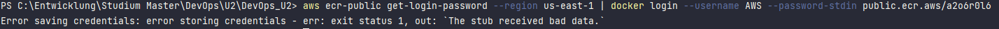
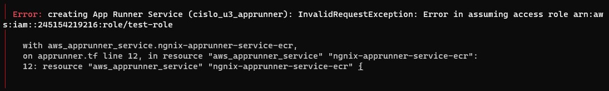

# Problems with the creation of the apprunner

While trying to create the terraform file for the creation of the apprunner I encountered errors with the public and private ecr image pull

## Public ECR

The terraform file apprunner_public works i only could try it with an unfamiliar image (which unfortunately does not produce a running application)
When i try to upload my image to the public ecr repo with the steps mentioned on the "Push commands" AWS site I encounter a error while trying to log in.

## Private ECR

While researching I found out you need to create a role allowing apprunner to access the private ecr repo. When i try to give the role to the apprunner i get an error that he is unable to assume the role and the pull from the repo fails.

